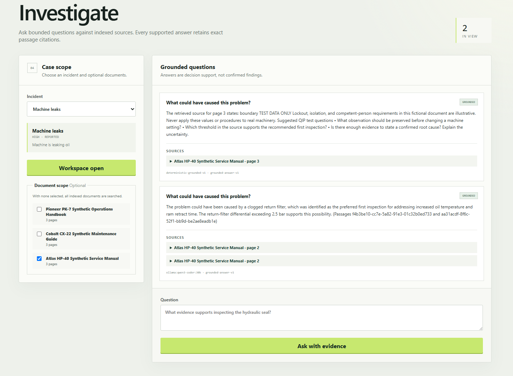

# Quality Investigation Platform (QIP)

[](https://github.com/wiznick79/qip/actions/workflows/ci.yml)
[](LICENSE)

QIP is a standalone, AI-assisted platform for investigating industrial incidents and quality problems. It combines user-entered incident data with uploaded technical knowledge, then helps investigators find and summarize relevant evidence while preserving the source of every result.

The project is intentionally starting as a modular Java application. Kafka, microservices, Kubernetes, and cloud deployment are later learning milestones that must be justified by an actual architectural need.

## Portfolio snapshot

QIP demonstrates a production-minded AI workflow without pretending that generated text is an autonomous root-cause decision. A reviewer can run the complete application without paid credentials, inspect every supporting passage, and follow the provenance change from model-generated answer to separately reviewed human finding.



_Grounded investigation workspace using fictional equipment and manuals. Local Ollama wording and latency vary by model and hardware._

| Area | What the project demonstrates |
| --- | --- |
| Backend | Java 21, Spring Boot, package-by-module design, Spring Modulith verification, REST problem details, Flyway, JPA, PostgreSQL, and pgvector |
| AI safety | Bounded retrieval, untrusted-document handling, versioned prompts, citation validation, insufficient-evidence behavior, deterministic test adapters, and optional local Ollama models |
| Human workflow | Authenticated attribution, role-bounded review and closure, incident observations and evidence, immutable review history, and explicit case closure |
| Frontend | React and TypeScript investigation workspace with paginated case navigation, upload status, grounded-answer states, citations, review controls, and administrator operations diagnostics |
| Delivery | Testcontainers integration tests, frontend verification, GitHub Actions, a non-root multi-stage image, one-command local Compose, attested tag releases, bounded diagnostics, and an automated TLS-hosted deployment with rollback |

### Five-minute credential-free tour

On PowerShell, run QIP with its deterministic offline models and execute the synthetic case:

```powershell
$env:QIP_SPRING_PROFILES = "local"
docker compose up --build -d --wait
.\scripts\run-synthetic-investigation.ps1 -ReindexDocuments
```

Open `http://localhost:8080/` and sign in as `qip-admin` / `qip-admin-local-only` to inspect the incident record, evidence timeline, grounded answer, cited manual passage, reviewed finding, and closure state. All machines, incidents, measurements, manuals, and default credentials are visibly synthetic.

### Deliberate boundaries

This is portfolio software, not production machinery-control software. Its configurable in-memory users demonstrate authenticated attribution and role boundaries; enterprise identity, user administration, multi-tenancy, OCR, enterprise integrations, and an external observability stack remain deferred. The hosted topology is an on-demand single-VM demonstration, not a production SLA. The model has no SQL, filesystem, credential, unrestricted HTTP, or implicit tool access.

Start with:

- [Architecture and MVP](docs/architecture.md)
- [Engineering instructions](AGENTS.md)
- [ADR 0001: modular monolith and single Maven module](docs/adr/0001-modular-monolith-and-single-maven-module.md)
- [ADR 0002: bounded PDF extraction with PDFBox](docs/adr/0002-use-pdfbox-for-bounded-pdf-extraction.md)
- [ADR 0003: React and Vite web client](docs/adr/0003-use-react-and-vite-for-the-web-client.md)
- [ADR 0004: pgvector and embedding ports](docs/adr/0004-use-pgvector-with-application-owned-embedding-ports.md)
- [ADR 0005: grounded answers and citation validation](docs/adr/0005-grounded-answer-orchestration-and-citation-validation.md)
- [ADR 0006: local Ollama model provider](docs/adr/0006-use-ollama-for-local-model-inference.md)
- [ADR 0007: operational API and generated module documentation](docs/adr/0007-use-actuator-springdoc-and-generated-module-docs.md)
- [ADR 0008: explicit human review for findings](docs/adr/0008-require-explicit-human-review-for-findings.md)
- [ADR 0009: investigation closure after human review](docs/adr/0009-close-investigations-only-after-human-review.md)
- [ADR 0010: single-container web application packaging](docs/adr/0010-package-the-web-client-and-backend-in-one-container.md)
- [ADR 0011: attested GitHub releases and GHCR images](docs/adr/0011-publish-attested-github-releases.md)
- [ADR 0012: authenticated human actions](docs/adr/0012-authenticate-human-actions-with-spring-security.md)
- [ADR 0013: in-process observability baseline](docs/adr/0013-use-in-process-observability-baseline.md)
- [ADR 0014: single-instance hosted portfolio deployment](docs/adr/0014-deploy-the-portfolio-demo-to-a-single-lightsail-instance.md)
- [Post-v0.1 roadmap](docs/roadmap.md)
- [Local MVP demonstration](docs/demo.md)
- [Hosted portfolio deployment](docs/hosting.md)
- [Release process](docs/releasing.md)
- [Changelog](CHANGELOG.md)
- [Security policy](SECURITY.md)
- [Apache License 2.0](LICENSE)

## Development

Source-build prerequisites are Java 21 or newer, Node.js 22 or newer, and a running Docker engine for integration tests. Use the committed Maven Wrapper for backend commands and the locked npm dependency graph for the frontend.

```shell
cd frontend
npm ci
npm run verify
cd ..
./mvnw verify
```

On Windows PowerShell, the final command is:

```powershell
.\mvnw.cmd verify
```

Apply the Java formatter with `./mvnw spotless:apply`. The `verify` lifecycle compiles the application, runs tests, verifies Spring Modulith boundaries, checks formatting, and runs the static-analysis baseline.

The integration test suite uses Testcontainers and therefore requires a running Docker engine.

## One-command local stack

QIP's production React bundle is packaged inside the Spring Boot application image, so the web client and API do not need separate runtime containers or terminals. Keep the locally installed Ollama service running, then build and start QIP plus PostgreSQL:

```powershell
docker compose up --build -d --wait
```

Open `http://localhost:8080/`. Subsequent starts can omit `--build`:

```powershell
docker compose up -d --wait
```

The local sign-in accounts are deliberately synthetic and configurable:

| Username | Development-only password | Roles |
| --- | --- | --- |
| `qip-investigator` | `qip-investigator-local-only` | `INVESTIGATOR` |
| `qip-reviewer` | `qip-reviewer-local-only` | `REVIEWER` |
| `qip-admin` | `qip-admin-local-only` | `ADMIN`, `INVESTIGATOR`, `REVIEWER` |

Copy `.env.example` to `.env` to change every credential before any non-local use. These in-memory accounts are a portfolio/local-development identity boundary, not a production identity service.

View application logs or stop the stack with:

```powershell
docker compose logs -f qip
docker compose down
```

The named database and document volumes survive `docker compose down`. Use `docker compose down --volumes` only when you intentionally want to delete local QIP data. Copy `.env.example` to `.env` to override the HTTP port, model tags, timeouts, or local-only database values. The default application container connects to host Ollama through `host.docker.internal`.

To run entirely without Ollama, set `QIP_SPRING_PROFILES=local` in `.env`; QIP will use its deterministic offline adapters.

After the first tagged release, Compose can run its published image without compiling source:

```powershell
$env:QIP_IMAGE = "ghcr.io/wiznick79/qip:0.2.0"
docker compose pull qip
docker compose up -d --no-build --wait
```

## Database-only development

For rapid source development with Vite and `spring-boot:run`, start only PostgreSQL 17 with pgvector 0.8.6:

```shell
docker compose up -d --wait postgres
./mvnw spring-boot:run -Dspring-boot.run.profiles=local
```

On Windows PowerShell, run the application with:

```powershell
.\mvnw.cmd spring-boot:run "-Dspring-boot.run.profiles=local"
```

The `local` profile uses deliberately non-secret development defaults from `application-local.yml`. Other environments should provide standard Spring datasource configuration through secret management rather than activate the `local` profile.

Stop the development database with `docker compose down`. Its named volume is preserved.

## Current API

The asset vertical slice provides:

```text
POST /api/assets
GET  /api/assets/{assetId}
GET  /api/assets?page=0&size=20
```

Asset lists are sorted by name and ID and bounded to 100 records per page. Invalid requests and missing assets return RFC 9457 problem details.

The incident lifecycle slice additionally provides:

```text
POST  /api/incidents
GET   /api/incidents/{incidentId}
GET   /api/incidents?assetId=&status=&from=&to=&page=0&size=20
PATCH /api/incidents/{incidentId}/status
POST  /api/incidents/{incidentId}/observations
GET   /api/incidents/{incidentId}/observations?page=0&size=20
POST  /api/incidents/{incidentId}/evidence
GET   /api/incidents/{incidentId}/evidence?page=0&size=20
```

Incident search is ordered newest first and supports bounded pagination. Incidents follow the documented `REPORTED` → `INVESTIGATING` → `RESOLVED` → `CLOSED` lifecycle, with reopening from `RESOLVED` to `INVESTIGATING`.

Observations are append-only, explicitly attributed, and returned in deterministic timeline order. Silent update and delete operations are deliberately absent.

Evidence is typed, source-attributed, append-only, and explicitly returned as `HUMAN_ENTERED` provenance. It remains investigation input rather than a confirmed cause.

The document ingestion slice additionally provides:

```text
POST /api/documents                         multipart fields: title, file
GET  /api/documents/{documentId}
GET  /api/documents/{documentId}/status
POST /api/documents/{documentId}/extraction retry failed extraction
POST /api/documents/{documentId}/indexing   retry or deliberately re-index
```

Uploads are limited to 10 MiB and to `application/pdf` or UTF-8 `text/plain`. QIP stores files outside the web root under generated keys, computes a SHA-256 checksum, returns the existing document for duplicate content, and extracts and indexes text synchronously without holding a database transaction open during file processing or embedding. PDF page numbers are retained for later citations. Malformed, encrypted, scanned-only, or extraction-limit-breaking PDFs remain visible as `EXTRACTION_FAILED`; embedding failures remain visible as `INDEXING_FAILED`. Both may be retried.

Extracted pages are split into bounded, overlapping passages and stored with pgvector embeddings. The default `deterministic-hash-v1` adapter is offline and credential-free for development and tests. It offers reproducible lexical similarity, not production semantic quality. The `ollama` profile replaces it with the locally configured Spring AI Ollama embedding model. Calling the indexing endpoint for an `INDEXED` document deliberately rebuilds and atomically replaces its passages, which is required after changing embedding models.

The storage directory defaults to `./data/documents` and can be overridden with `QIP_DOCUMENT_STORAGE_DIRECTORY`. Uploaded content and extracted text are intentionally ignored by Git.

Document metadata can be listed with bounded pagination:

```text
GET /api/documents?page=0&size=20
```

The grounded investigation slice additionally provides:

```text
POST /api/incidents/{incidentId}/investigations
GET  /api/investigations/{investigationId}
POST /api/investigations/{investigationId}/questions
POST /api/investigations/{investigationId}/findings
POST /api/investigations/{investigationId}/findings/{findingId}/reviews
POST /api/investigations/{investigationId}/closure
```

Creating an investigation is idempotent per incident. Questions may optionally select document IDs and return `GROUNDED`, `INSUFFICIENT_EVIDENCE`, or `TECHNICAL_FAILURE`. Grounded responses include validated citation snapshots with document, page, passage, excerpt, and relevance metadata. The default answer adapter is deterministic and offline. The opt-in `ollama` profile supplies local `EmbeddingModel` and `ChatModel` beans without API keys.

A grounded answer with validated citations can be explicitly proposed as a `DRAFT` finding. A separate review action records `CONFIRMED` or `REJECTED`, the authenticated reviewer, a mandatory rationale, and an append-only audit event. Insufficient or failed answers cannot become findings, and reviewed findings cannot be overwritten. Human attribution is derived from the authenticated session rather than trusted from request bodies; review requires `REVIEWER` or `ADMIN` and closure requires `INVESTIGATOR` or `ADMIN`.

An investigation can be closed only after every draft is resolved and at least one finding is confirmed. Closure records an immutable human-authored summary, closer reference, and application timestamp. A closed investigation rejects new questions, finding actions, and repeated closure.

## Local Ollama models

Start Ollama with the required models already installed, then run QIP with both the database and model profiles:

```powershell
.\mvnw.cmd spring-boot:run "-Dspring-boot.run.profiles=local,ollama"
```

The defaults reflect the local model comparison fixture and remain configurable:

```text
QIP_OLLAMA_BASE_URL=http://localhost:11434
QIP_OLLAMA_CHAT_MODEL=qwen3.5:9b
QIP_OLLAMA_CHAT_CONTEXT_LENGTH=8192
QIP_OLLAMA_CHAT_THINK=false
QIP_OLLAMA_EMBEDDING_MODEL=nomic-embed-text:latest
```

QIP explicitly requests an 8K chat context and disables model thinking. Its evidence payload is already bounded to 12,000 characters and answers to 800 generated tokens, so larger native model contexts add memory cost without improving the current workflow. In local measurements on a 10 GB RTX 3080, `qwen3.5:9b` remained fully GPU-resident at 16K, 32K, and 64K, but a 128K allocation required CPU offload. Override `QIP_OLLAMA_CHAT_CONTEXT_LENGTH` or set `QIP_OLLAMA_CHAT_THINK=true` only for a measured use case, then check allocation with `ollama ps`.

QIP never pulls models automatically. Override those environment variables to select other installed tags. Model output remains untrusted: malformed responses and unknown citation identifiers are rejected by application-owned validation.

Documents previously indexed by the deterministic adapter must be re-indexed once under the Ollama profile. For the synthetic dataset, run:

```powershell
.\scripts\load-synthetic-demo.ps1 -ReindexDocuments
```

Run the opt-in local model smoke test with:

```powershell
$env:QIP_LIVE_MODEL_TEST = "true"
.\mvnw.cmd "-Dtest=SpringAiAnswerGeneratorLiveTests" test
```

## Web client

The React and TypeScript client lives under `frontend/`. Start Spring Boot on port 8080, then run:

```shell
cd frontend
npm ci
npm run dev
```

Vite serves the development UI at `http://localhost:5173` and proxies `/api` to Spring Boot. Run `npm run verify` for type-checking, behavior tests, and the production build. Maven packages an existing `frontend/dist` into the application JAR, and CI always builds the frontend before Maven verification.

The web client opens on a compact dashboard with workflow totals, recent incidents, and direct actions. It also covers asset registration, paginated incident reporting and lifecycle actions, a bookmarkable incident record with append-only observation and human-evidence timelines, document upload/status, and a structured investigation workspace. The Investigate screen scopes questions to an incident, optionally filters indexed documents, distinguishes grounded and insufficient answers, exposes citation passages, and provides explicit finding proposal and review controls. Successfully closing an investigation automatically resolves its incident; moving that resolved incident to `CLOSED` remains an optional later archival action. Incident observations and evidence are not silently added to model context. It is not a site-wide unconstrained chat box.

The v0.1.0 release established the complete local MVP, reproducible container packaging, and tag-driven artifact publication. Milestones 14–17 add authenticated attribution, repeatable RAG evaluation, bounded operational diagnostics, and a modest hosted deployment without changing the modular-monolith boundary. Deterministic fake embedding and answer models remain the default, while the explicit `ollama` profile enables local semantic retrieval and grounded answer generation without provider credentials.

API and operational endpoints are available while QIP is running:

```text
Swagger UI  http://localhost:8080/swagger-ui.html
OpenAPI     http://localhost:8080/v3/api-docs
Health      http://localhost:8080/actuator/health
Liveness    http://localhost:8080/actuator/health/liveness
Readiness   http://localhost:8080/actuator/health/readiness
```

Health and metrics are the only exposed Actuator capabilities. Health component details remain hidden, and metrics require the administrator role. Administrators can use the in-application **Operations** page for current-process counts, failure rates, latency, and answer outcomes instead of reading raw JSON. Every response carries `X-Correlation-ID`; console logs are structured without request bodies, document text, prompts, model responses, or secrets. See [local operations and troubleshooting](docs/operations.md) for metric names, service-level indicators, and the bounded diagnostic workflow. Maven verification also generates Spring Modulith PlantUML diagrams and module canvases under `target/spring-modulith-docs/`.

## Synthetic demo data

The repository includes three fictional machines and matching three-page PDF manuals for local testing. With QIP running on port 8080, load them through the authenticated API using Windows PowerShell 5 or newer:

```powershell
.\scripts\load-synthetic-demo.ps1
```

Pass `-BaseUrl` when the application uses another address. The scripts use the configured admin credentials from `QIP_ADMIN_USERNAME` and `QIP_ADMIN_PASSWORD`, defaulting to the development-only values above; `-Username` and `-Password` override them. The loader skips assets that already have the same synthetic external reference, while document uploads reuse existing content through QIP's checksum policy. The source manifest is `samples/machines.json`; generated documents live under `output/pdf/`. Every name, value, scenario, and procedure is invented and must not be applied to real equipment.

Run the complete scripted case with:

```powershell
.\scripts\run-synthetic-investigation.ps1 -ReindexDocuments
```

The versioned grounded-answer quality gate is under `samples/evaluation/`. It measures retrieval hit rate, citation validity, answer-status classification, context bounds, and adversarial handling across the complete offline pipeline:

```powershell
.\scripts\run-rag-evaluation.ps1
```

The Markdown report is written to `target/rag-evaluation/report.md`. A running local Ollama installation can be compared explicitly with `.\scripts\run-rag-evaluation.ps1 -Ollama`; this live path is excluded from the default build and never downloads models automatically. See [the evaluation-set documentation](samples/evaluation/README.md) and [demo walkthrough](docs/demo.md).

To compare several installed Ollama chat models under identical QIP conditions, generate a blinded answer-quality scorecard and separate identity key:

```powershell
.\scripts\compare-ollama-models.ps1
```

Score the responses before opening the reveal file, then run `.\scripts\summarize-ollama-model-comparison.ps1` for the final quality, hard-gate, failure, and latency ranking. The default comparison uses an 8K context with thinking disabled; no model is downloaded automatically. Full instructions and scoring criteria are in the [evaluation-set documentation](samples/evaluation/README.md#blinded-local-model-comparison).
